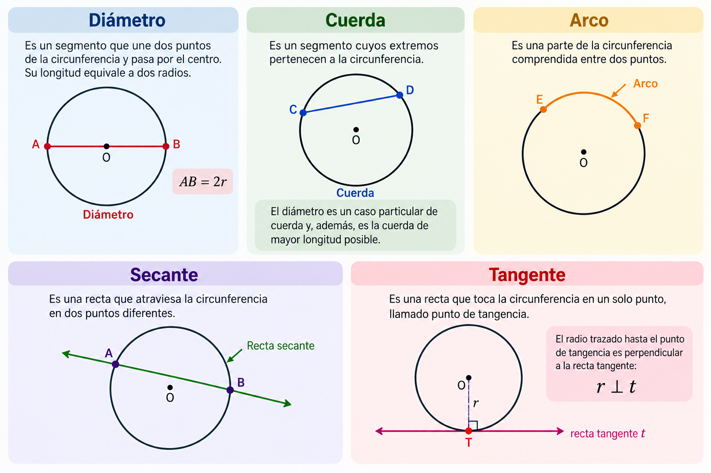

# Guía de estudio: La Circunferencia

## Lección 1. Introducción a la circunferencia

Una **circunferencia** es el conjunto de todos los puntos de un plano que se encuentran a la misma distancia de un punto fijo llamado **centro**.

Es importante distinguir entre **circunferencia** y **círculo**:

- La **circunferencia** es únicamente la línea curva cerrada.
- El **círculo** comprende la circunferencia y toda la región interior que esta encierra.

Por ejemplo, si se dibuja una circunferencia con un compás, la punta fija del compás determina el centro y la abertura del compás determina el radio.

### 1.1 Centro

El **centro** es el punto fijo que se encuentra a la misma distancia de todos los puntos de la circunferencia.

En geometría analítica suele representarse mediante:

$$
C(h,k)
$$

donde:

- $h$ es la coordenada horizontal del centro.
- $k$ es la coordenada vertical del centro.

Por ejemplo, si:

$$
C(3,2)
$$

el centro se encuentra 3 unidades a la derecha del origen y 2 unidades hacia arriba.

### 1.2 Radio

El **radio**, representado normalmente por $r$, es la distancia desde el centro hasta cualquier punto de la circunferencia.

Si una circunferencia tiene centro $C(3,2)$ y un punto $P(7,2)$ pertenece a ella, el radio es:

$$
r=4
$$

porque la distancia entre ambos puntos es de 4 unidades.

El radio siempre debe cumplir:

$$
r>0
$$

### 1.3 Otros elementos

Además del centro y del radio, aparecen otros elementos importantes:

**Diámetro:** segmento que une dos puntos de la circunferencia y pasa por el centro. Su longitud es el doble del radio:

$$
d=2r
$$

**Cuerda:** segmento que une dos puntos de la circunferencia. No necesariamente pasa por el centro. El diámetro es, por tanto, una cuerda especial.

**Arco:** parte de la circunferencia comprendida entre dos puntos.

**Secante:** recta que atraviesa la circunferencia en dos puntos.

**Tangente:** recta que toca la circunferencia en exactamente un punto. El radio trazado hasta el punto de tangencia es perpendicular a la tangente.

### Comprobación del aprendizaje

Una circunferencia tiene radio de 6 cm. ¿Cuánto mide su diámetro?

Como:

$$
d=2r
$$

entonces:

$$
d=2(6)=12\text{ cm}
$$

---

# Lección 2. Ecuación de la circunferencia

En geometría analítica, una circunferencia puede representarse mediante una ecuación. Esto permite conocer su posición y tamaño sin necesidad de observar directamente una gráfica.

Las dos representaciones principales son la **forma ordinaria** y la **forma general**.

## 2.1 Forma ordinaria

Si el centro es:

$$
C(h,k)
$$

y el radio es $r$, la ecuación ordinaria es:

$$
\boxed{(x-h)^2+(y-k)^2=r^2}
$$

Esta ecuación proviene de la fórmula de distancia entre un punto cualquiera $P(x,y)$ de la circunferencia y su centro $C(h,k)$.

### Ejemplo 1

Considérese:

$$
(x-3)^2+(y-2)^2=25
$$

Comparando con:

$$
(x-h)^2+(y-k)^2=r^2
$$

se obtiene:

$$
h=3,\qquad k=2
$$

y:

$$
r^2=25
$$

por lo que:

$$
r=5
$$

Así, la circunferencia tiene:

$$
\boxed{C(3,2),\quad r=5}
$$

### Cuidado con los signos

Considérese:

$$
(x+4)^2+(y-7)^2=9
$$

Puede escribirse como:

$$
(x-(-4))^2+(y-7)^2=3^2
$$

Por tanto:

$$
\boxed{C(-4,7),\quad r=3}
$$

El signo que aparece dentro del paréntesis es el **opuesto** de la coordenada correspondiente del centro.

### Caso especial: centro en el origen

Cuando:

$$
C(0,0)
$$

la ecuación se simplifica:

$$
\boxed{x^2+y^2=r^2}
$$

Por ejemplo:

$$
x^2+y^2=49
$$

representa una circunferencia de centro:

$$
C(0,0)
$$

y radio:

$$
r=7
$$

---

# Lección 3. Forma general de la circunferencia

La forma general puede escribirse como:

$$
\boxed{x^2+y^2+Dx+Ey+F=0}
$$

donde $D$, $E$ y $F$ son números reales.

A diferencia de la forma ordinaria, aquí el centro y el radio no siempre pueden identificarse inmediatamente.

## De ordinaria a general

Considérese:

$$
(x-2)^2+(y-3)^2=16
$$

Primero se desarrollan los cuadrados:

$$
x^2-4x+4+y^2-6y+9=16
$$

Se agrupan los términos:

$$
x^2+y^2-4x-6y+13=16
$$

Finalmente, todo se coloca de un lado:

$$
\boxed{x^2+y^2-4x-6y-3=0}
$$

Esta es la forma general.

## De general a ordinaria

El procedimiento inverso requiere **completar cuadrados**.

Considérese:

$$
x^2+y^2-6x+4y-12=0
$$

Se agrupan los términos:

$$
(x^2-6x)+(y^2+4y)=12
$$

Para completar el primer cuadrado:

$$
x^2-6x+9=(x-3)^2
$$

Para el segundo:

$$
y^2+4y+4=(y+2)^2
$$

Como se agregaron $9$ y $4$ al lado izquierdo, también deben agregarse al derecho:

$$
(x-3)^2+(y+2)^2=12+9+4
$$

Por tanto:

$$
(x-3)^2+(y+2)^2=25
$$

Ahora se identifica fácilmente:

$$
\boxed{C(3,-2),\quad r=5}
$$

---

# Ejercicios

### Ejercicio 1. 

En una plaza se construirá una fuente circular. Su centro se ubica en el punto $C(4,3)$ de un plano y tendrá un radio de 6 metros.

**Pregunta:** ¿Cuál es la ecuación ordinaria de la circunferencia que representa el borde de la fuente?

### Ejercicio 2. 

Una antena se encuentra en $A(-2,5)$. Por razones de seguridad se establece un límite circular a 8 metros de la antena.

**Pregunta:** ¿Cuál es la ecuación del límite de seguridad?

### Ejercicio 3. 

El borde de una glorieta está representado por:

$$
x^2+y^2-10x+6y+18=0
$$

**Preguntas:** ¿Dónde está ubicado su centro? ¿Cuál es su radio?

**Pista:** agrupar los términos de $x$ y de $y$, y después completar cuadrados.

### Ejercicio 4. 

Un sistema de riego cubre una región circular. El aspersor se encuentra en el punto $C(2,-4)$ y el agua alcanza hasta 7 metros desde el aspersor.

Determinar:

1. El radio de la circunferencia.
2. El diámetro de la región cubierta.
3. La ecuación ordinaria.
4. La ecuación general.

### Ejercicio 5. 

Una circunferencia está representada por:

$$
x^2+y^2+8x-10y+16=0
$$

Sin consultar una gráfica:

1. Transformar la ecuación a su forma ordinaria.
2. Determinar las coordenadas del centro.
3. Calcular el radio.
4. Explicar qué significado geométrico tienen el centro y el radio obtenidos.
